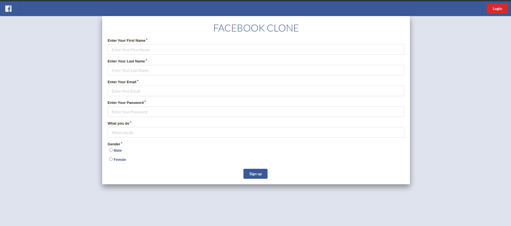
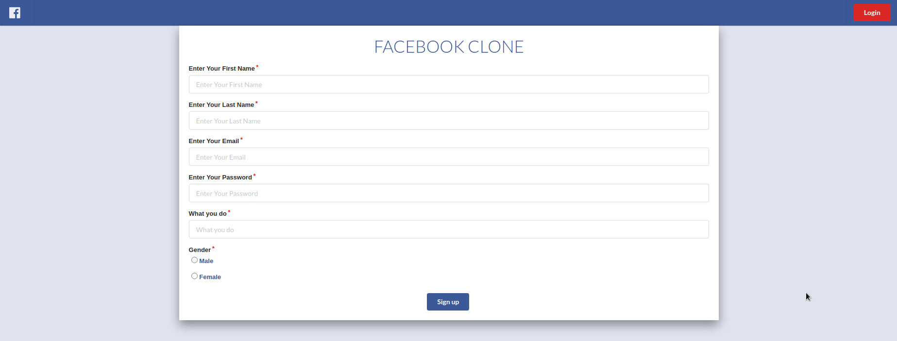
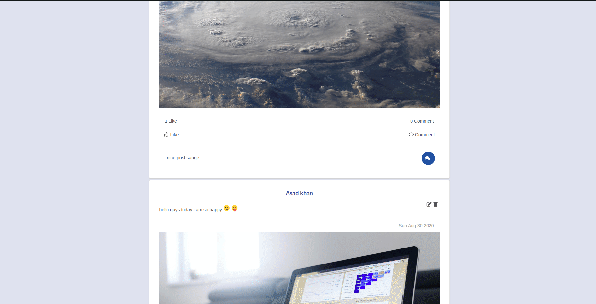
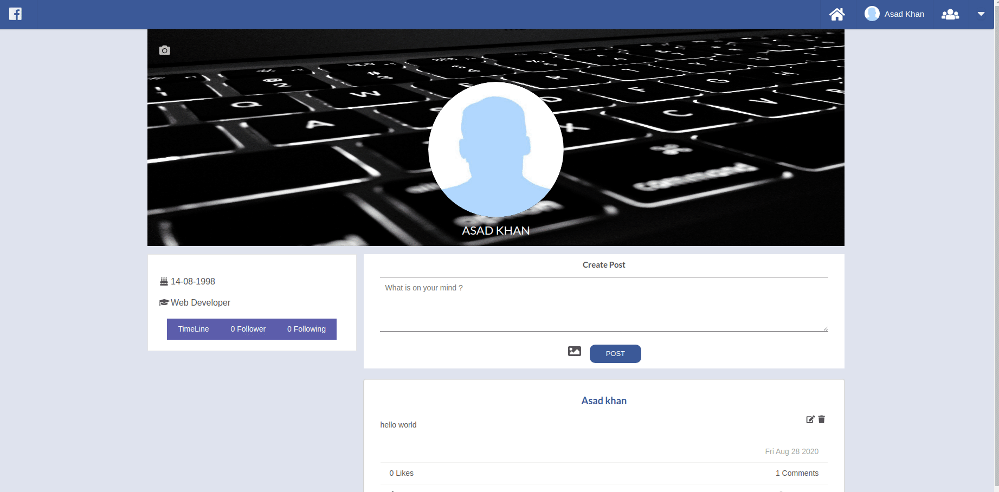
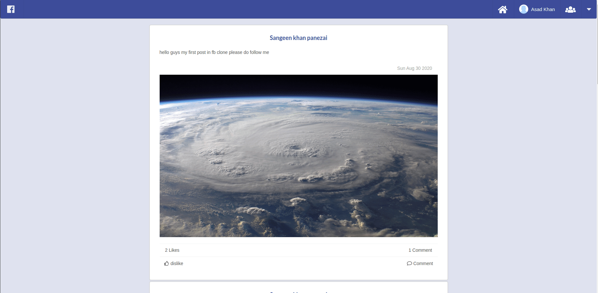
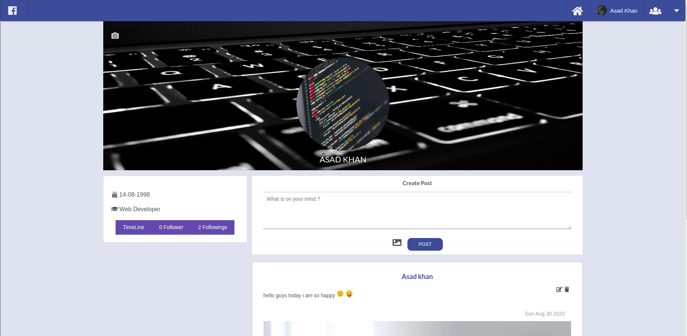
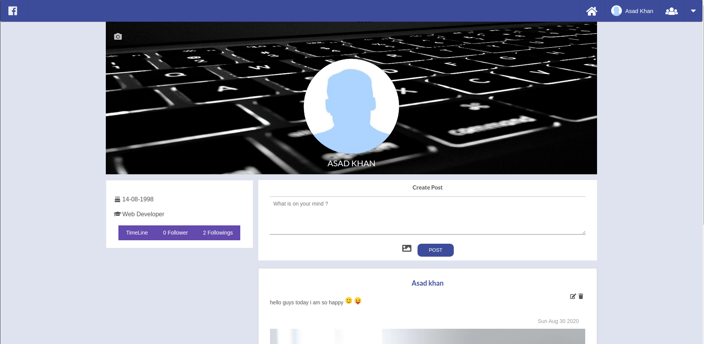

# Facebook Clone

## Description

A Web app Build using MERN

### Backend

Backend Rest Api is powered by

- Expressjs for restful Api
- MongodDb used as Database
- joi for validation

### Frontend

Frontend SPA is build using

- React
- Redux

## Functionalities

1. User can Login / Register to Fb Clone (Authentication)
2. User can create/delete/update posts
3. User can create/delete/update pages
4. User can create/delete/update Groups and can add other members to that group.
5. User can comment or like a post
6. User can follow/unFollow/Block other Users.

## Demo

#### Sign Up



### Login



#### Post Functionalities

#### Create a Post


#### Leave a Like and Comment on a Post



#### Follow/UnFollow



#### Create Groups



#### Create Pages



#### Block User


#### Upload a new Dp



#### Home Page


## How To use this project

```shell
clone this project by
git clone https://github.com/Asad8746/FbCLone

# install all the dependencies
cd fb-clone-backend && npm install
cd client && npm install
```

```shell
# Runing the app
cd fb-clone-backend && npm start
cd client && npm start
```
